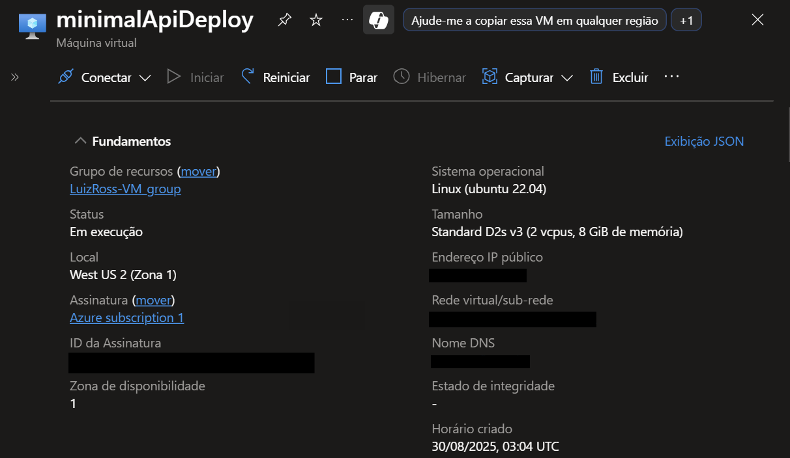
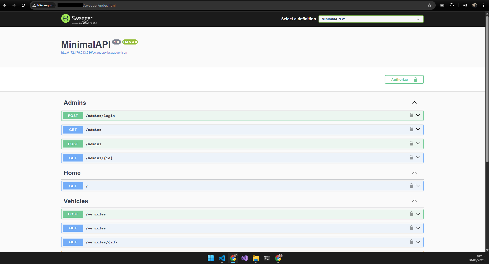

# DIO - Trilha .NET - Minimal API
www.dio.me

## Máquina virtual Azure utilizada para o deploy

## Deploy realizado

## Desafio de projeto
Para este desafio, você precisará usar seus conhecimentos adquiridos no módulo de APIs, da trilha .NET da DIO.

## Contexto
A partir da Minimal API de Cadastro de Veículos, elabore testes para cada um dos elementos pertinentes utilizando o modelo MSTest. 

## Proposta
- Desenvolva testes, fazendo uso do modelo MSText, para as Entidades -> Admin e Vehicle, parte do sistema da API

- Posteriormente, desenvolva testes de Persistência de Dados

- Testes de Request

- Faça o deploy da aplicação para concluir o desafio

## Solução
O código foi desenvolvido em conjunto das videoaulas, sendo proposto que fossem gerados testes para as Entidades e demais elementos-chave do sistema da API.
